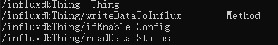
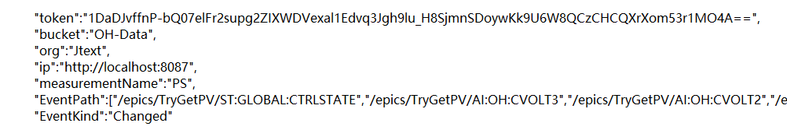
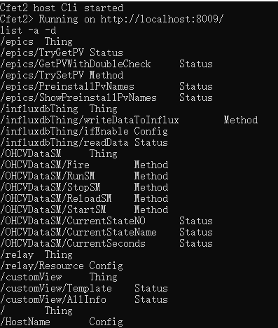

## influxdbThing
influxdb是CFET中的一个thing，该thing提供了influxdb数据库的读写接口

## CRs

writeDataToInflux有三个参数，分别是measurementName,  metric和 data
其中measurement可以简单的理解为表
metric在这里可以理解为influxdb里面的tags
data对应field

## 运行逻辑
会订阅需要监控的CR，如果有publish，就判断ifEnable是否是True，如果是True，就代表可以写，则把publish的数据写入influxdb中，否则丢掉

influxdb中的metric就对应CRName

## 配置文件

## 还可以结合其他thing的配合
比如状态机和relay等
Jtext上用的infuxdb的运行版本就有状态机和epicsthing等
放在release中

